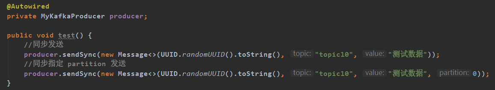

# `kafka_client介绍`
## **背景：**
kafka 具有吞吐量高,高压高堆积的特点,从 0.8.x 版本到 0.10.x 1.x 2.x版本,kafka本身发生了多次变革,修正了大多bug也引入了新功能和特性
,其client的使用也变的复杂多样,不同的人可能有不同的使用方式,由于开发的使用不当导致消息丢失,消息消费跟踪日志不足的事情屡屡发生,同时kafka消费者端没有实现监控功能
当发生消息丢失或者消息滞留的情况下，消费者无法及时发觉，导致消费者被压垮。

## **目标：**
本项目的目的,通过和spring的整合,提供一套配置完成开箱即用的client封装给开发者,通过配置的方式体验kafka的各种特性,
同时topic和topic之间的消费又保持着一定的隔离性,彼此直接不干预,同时提供生成者消费者监控,和环境日志的记录,保证出现异常的时候开发有足够的日志信息  

**目标如下:**  
1、发挥新版kafka api的特性(如事物，幂等消息)  
2、整合spring尽可能做到开箱即用  
3、从push模式转换成poll模式，增加吞吐量,同时保护consumer安全性  
4、整合公司现有的监控平台，例如：cat，当发生消息堆积的时候及时发起告警功能  
5、增加特性,例如允许JVM内部广播（一条消息多个实例消费）  
6、利用新版kafka特点降低对 zookeeper的依赖  
7、降低消息丢失的风险  

#### 新增功能:
1、生产者发送消息到指定 partition  
2、消费者代码接口改进（抽离成多个接口和抽象类） 
3、对接Cat监控  

### **项目结构依赖**
| 名称                | 版本    
| -----             |-----:   
| spring            | 5.1.5.RELEASE      
| spring-boot       | 2.2.1.RELEASE   
| commons-lang3     | 3.9     
| fastjson          | 1.2.58   
| lombok            | 1.18.6   
| kafka-clients     | 2.3.0   
| guava             | 27.1-jre   

### **版本更新**
| 版本号                | 更新内容       
| -----                  |-----: 
| 1.5.0-kafka_config-RELEASE            |集成springboot和配置文件对接   
| 1.5.8-kafka_config-RELEASE            |分离全局配置和个别consumer单独配置     
| 1.6.0-kafka_annotations-RELEASE            |支持注解配置消费者      

## **使用Demo：**
### **生产者**
##### 项目配置
 
 
配置名称和官网相近，参考 KafkaConsumerConfig 和 KafkaProducerConfig
##### 同步发送消息：
 

##### 异步发送消息：
 

##### 事务发送消息：
 

##### 消费消息：
 

## **设计：**
### **项目结构**
 
### **生产者**
##### 支持官网的生产者模型:（生产者使用TheadLocal不使用对象池）
 

### **消费者**
##### 支持官网的消费者模型:
 

 

##### **消费者模型**
 

### **待做功能**
1、消息上下游链路监控  
2、图片流或者视频流传输  
3、拓展更多的配置项
